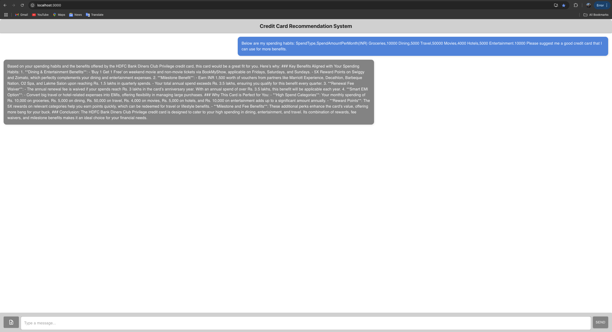

Run the application with `npm start` command.

Please ensure that you have the backend application already pulled, setup and running : https://github.com/pandeyad/CardRecommendationSystemBackend

You can use the sample csv file : [sample.csv](sample.csv)